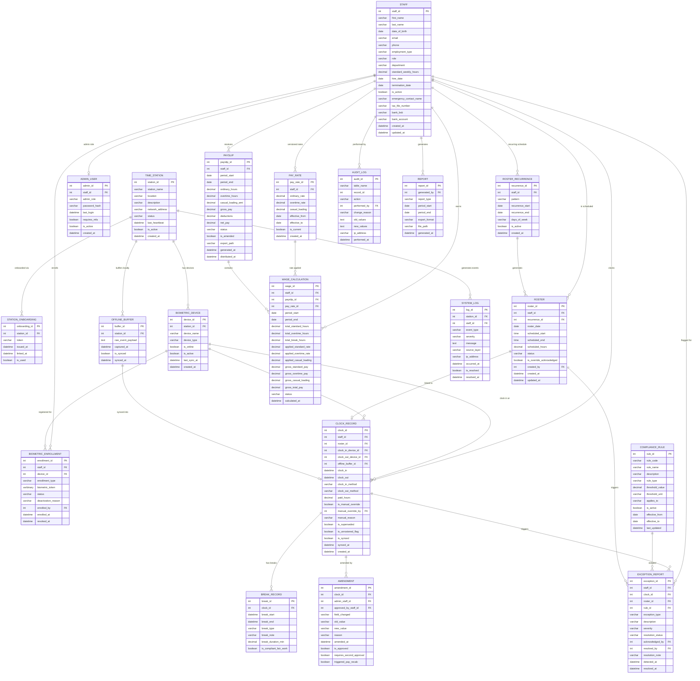

# Farm Time Management System - ER Diagram (v3 Combined)

> Merged design: Seung Yun (v2) + Asif ER Design
> Mermaid ER Diagram. Copy the content inside the code block and paste it into [mermaid.live](https://mermaid.live) to render.

## Entity Summary (20 Tables + 5 Views)

### Staff & HR Layer

| Entity | Description |
|--------|-------------|
| **STAFF** | Employee master data. Personal info, contract type, role, department, bank details, emergency contact |
| **PAY_RATE** | Versioned pay rates per staff. Tracks rate history with effective dates and casual loading |
| **ADMIN_USER** | Administrator authentication. Separate from Staff role — includes password hash and MFA flag |
| **ROSTER_RECURRENCE** | Recurring schedule patterns (Weekly, Fortnightly, Monthly) with day-of-week configuration |
| **ROSTER** | Work schedule per staff per day. Computed hours column. Links to recurrence pattern |

### Device & Biometric Layer

| Entity | Description |
|--------|-------------|
| **TIME_STATION** | Physical clock-in/out locations with network address, health status, and heartbeat monitoring |
| **STATION_ONBOARDING** | Zero-touch provisioning tokens for new station deployment |
| **BIOMETRIC_DEVICE** | Recognition devices per station (Card/Face/Fingerprint/Retinal). 1 station can have N devices |
| **BIOMETRIC_ENROLLMENT** | Staff-to-biometric/card registration. Handles lost card, finger injury, re-registration |

### Time Capture Layer

| Entity | Description |
|--------|-------------|
| **OFFLINE_BUFFER** | Raw event payloads captured locally when internet is unavailable. Synced to central server later |
| **CLOCK_RECORD** | Actual clock-in/out records. Separate in/out devices, manual override, offline sync, unrostered flag |
| **BREAK_RECORD** | Break records with type, free-text note, computed duration, and Fair Work compliance flag |
| **AMENDMENT** | Structured time entry amendments with dual-approval workflow and pay recalculation trigger |

### Payroll Layer

| Entity | Description |
|--------|-------------|
| **WAGE_CALCULATION** | Period-based hours and pay calculation with rate snapshots (standard, overtime, casual loading) |
| **PAYSLIP** | Fortnightly pay slips with gross/deductions/net, amendment flag, and export path |

### Compliance & Audit Layer

| Entity | Description |
|--------|-------------|
| **COMPLIANCE_RULE** | Fair Work Australia legal thresholds. Configurable per contract type with effective dates |
| **EXCEPTION_REPORT** | Flagged exceptions with severity, 3-state resolution workflow, and acknowledgement tracking |
| **AUDIT_LOG** | Generic change audit trail for all tables. Mandatory reason, JSON snapshots, IP tracking |

### Reporting & System Layer

| Entity | Description |
|--------|-------------|
| **REPORT** | Report generation tracking — who generated what report, when, in which format |
| **SYSTEM_LOG** | Infrastructure/device event logging with severity, source layer, and resolution tracking |

## Views

| View | Purpose |
|------|---------|
| `vw_CostAnalysis` | Management cost analysis by period and staff (includes casual loading) |
| `vw_AttendanceSummary` | Attendance overview with roster comparison, station info, and unrostered flags |
| `vw_OpenExceptions` | Dashboard of unresolved/acknowledged exceptions with compliance rule details |
| `vw_PendingAmendments` | Approval queue for pending time entry amendments |
| `vw_CurrentPayRates` | Current active pay rates per active staff member |
