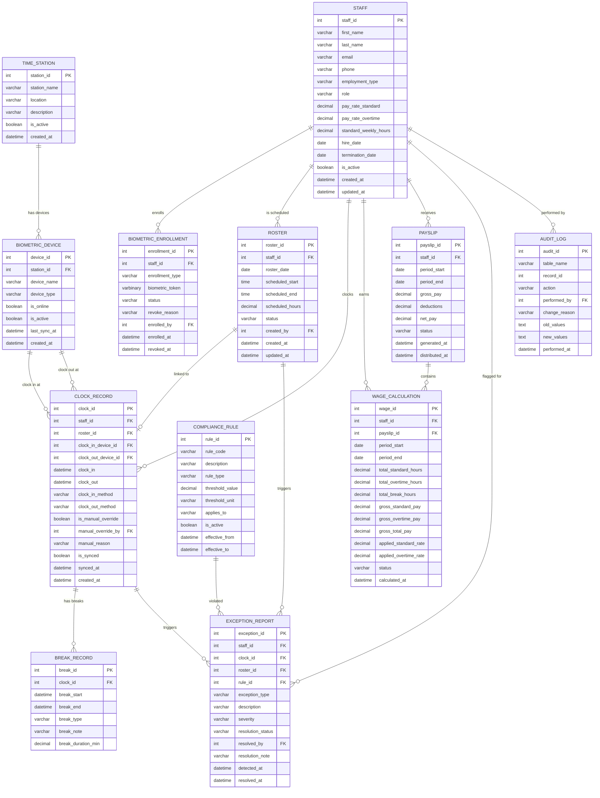

# Farm Time Management System - ER Diagram (v2)

> Mermaid ER Diagram. Copy the content inside the code block and paste it into [mermaid.live](https://mermaid.live) to render.

## Entity Summary (12 Tables + 3 Views)

| Entity | Description |
|--------|-------------|
| **STAFF** | Employee master data. Contract type (Casual/FullTime/PartTime), role, pay rates, standard weekly hours |
| **TIME_STATION** | Physical clock-in/out locations on the farm (Gate, Barn, Shed, Office) |
| **BIOMETRIC_DEVICE** | Recognition devices installed at each station (Card/Face/Fingerprint/Retinal) |
| **BIOMETRIC_ENROLLMENT** | Staff-to-biometric/card registration. Handles lost card, finger injury, re-registration |
| **ROSTER** | Work schedule. Date, start/end time, scheduled hours per staff |
| **CLOCK_RECORD** | Actual clock-in/out records. Supports biometric and manual (emergency) entry. Separate in/out devices |
| **BREAK_RECORD** | Break records linked to clock records. Type + free-text note |
| **COMPLIANCE_RULE** | Fair Work Australia legal thresholds (max weekly hours, mandatory breaks, rest periods) |
| **WAGE_CALCULATION** | Period-based hours and pay calculation with rate snapshots |
| **PAYSLIP** | Fortnightly pay slips with gross/deductions/net |
| **EXCEPTION_REPORT** | Flagged exceptions: missed clock-out, no break after 4h, unrostered attempt, overtime exceed |
| **AUDIT_LOG** | Change audit trail for all data modifications. Reason mandatory |

## Views

| View | Purpose |
|------|---------|
| `vw_CostAnalysis` | Management cost analysis by period and staff |
| `vw_AttendanceSummary` | Attendance overview with roster comparison and station info |
| `vw_OpenExceptions` | Dashboard of unresolved exceptions with compliance rule details |
